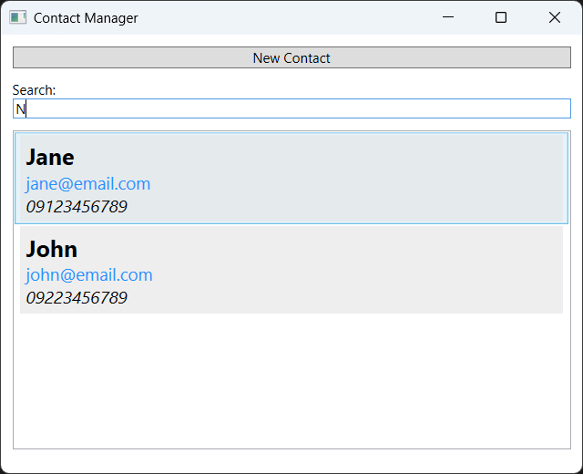
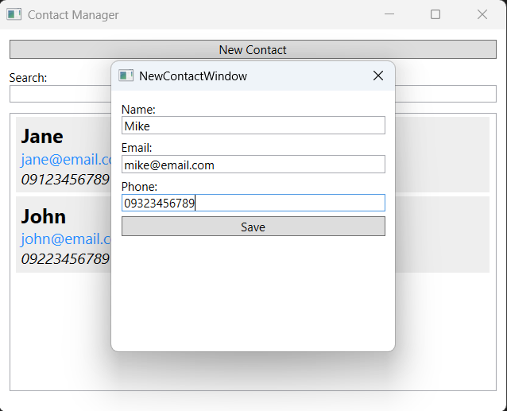
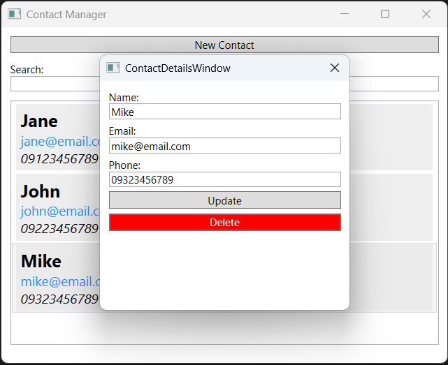

# Contacts Manager (WPF)

A simple desktop app for managing personal contacts, built with **WPF** and **.NET 10**. Create, update, delete, and search contacts through a clean, responsive UI.

## Features

- ➕ **New contact** — add name, email, and phone
- ✏️ **Update contact** — edit any existing contact
- 🗑️ **Delete contact** — delete any existing contact
- 🔍 **Search contacts** — live filtering across name
- 💾 **Persistent storage** — saves to a local database
- 🎨 **Responsive UI** — Simple, responsive layout

## Screenshot





## Requirements

- Windows 10 or later
- [.NET 10 SDK](https://dotnet.microsoft.com/en-us/download/dotnet/10.0)

## Getting Started

### Clone

```bash
git clone https://github.com/Shayan-git/Contacts_Manager_WPF
cd DesktopContactsApp
```
